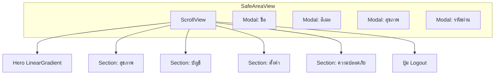

# เทมเพลตสไลด์การจัดวาง — `ProfileScreen.js`

เอกสารนี้อธิบาย **ลำดับและโครงสร้างการจัดวาง (layout)** ของหน้าโปรไฟล์ ใช้เป็นต้นแบบเมื่อออกแบบหน้าอื่นในแอป (SafeArea → ScrollView → บล็อกย่อย → Modal)

---

## สไลด์ 1 — โครงราก (Root)

| ชั้น | คอมโพเนนต์ | หมายเหตุ |
|------|------------|----------|
| 1 | `SafeAreaView` | พื้นหลัง `#F8F9FA`, `styles.container` |
| 2 | `ScrollView` | `contentContainerStyle` = `scrollContent` (padding ล่างให้ clear tab) |
| 3 | เนื้อหาใน Scroll | การ์ด hero → หัวข้อซекция → การ์ด/แถว → ปุ่ม logout |
| 4 | `Modal` หลายตัว | อยู่ **นอก** ScrollView ระดับเดียวกับ Scroll ภายใต้ SafeArea |



---

## สไลด์ 2 — Hero card (การ์ดบน)

**คอนเทนเนอร์:** `LinearGradient` → `styles.heroCard`  
**ไล่สี:** `#EEF5F0` → `#FFFFFF` (บน → ล่าง)

ลำดับจากบนลงล่างภายใน hero:

| ลำดับ | โซน | สไตล์ / พฤติกรรม |
|--------|-----|-------------------|
| 1 | เหรียญ | `heroCoinWrap` — `position: absolute` มุมขวาบน |
| 2 | อวตาร | `avatarShadowWrap` → `TouchableOpacity` → รูป / placeholder + overlay กล้อง |
| 3 | ข้อความ | `changePhotoText` — “เปลี่ยนรูป” |
| 4 | แถวชื่อ | `nameRow` — ซ้ายว่าง / กลางชื่อ / ขวาไอคอนแก้ไข |
| 5 | เลเวล + XP | `levelSection` — แยกเส้นบน (hairline), แถว: วง LV + ชื่อระดับ + แถบ XP |

**เทมเพลตคัดลอก (โครงเท่านั้น):**

```text
LinearGradient (hero)
  ├─ absolute: secondary badge (optional)
  ├─ primary visual (avatar / logo)
  ├─ caption under primary
  ├─ title row (balanced: spacer | title | action)
  └─ metrics strip (optional divider + stats / progress)
```

---

## สไลด์ 3 — หัวข้อซекция (Section header pattern)

รูปแบบซ้ำทั้งหน้า:

```text
View.sectionHeaderRow
  ├─ Ionicons (16, accent)
  └─ Text.sectionLabel (uppercase, letter-spacing)
```

ใช้กับ: ข้อมูลสุขภาพ, ข้อมูลส่วนตัว, ตั้งค่าแอป, ข้อมูลและความปลอดภัย

**เทมเพลต:** ไอคอน outline + ป้ายหมวดสี `#666` + margin บน/ล่างคงที่

---

## สไลด์ 4 — เนื้อหาตามซекция

| ซекция | คอนเทนเนอร์หลัก | คอมโพเนนต์ / โน้ต |
|--------|------------------|------------------|
| สุขภาพ | — | `ProfileHealthRow` (props น้ำหนัก/ส่วนสูง/BMI/อายุ + callback แก้ไข) |
| ส่วนตัว | `gridContainer` | `ProfileAccountCard` (อีเมล + รหัสผ่าน) |
| ตั้งค่า | `cardFull` | แถวสลับ + `cardHeaderIndicator` แถบซ้าย 5px |
| ความปลอดภัย | `TouchableOpacity` + `cardFull` | แถวนโยบาย + chevron |
| ออกจากระบบ | `logoutBtn` | ปุ่มเต็มความกว้าง, border สีเน้น (แดง) |

**การ์ดมาตรฐาน (`cardFull`):** พื้นขาว, มุม 16, เงาเบา, `overflow: hidden`, แถบ accent ซ้าย (`cardHeaderIndicator`)

---

## สไลด์ 5 — Modal (แพทเทิร์นเดียวกัน)

ทุก Modal ใช้โครงเดียว:

```text
Modal (transparent, fade)
  └─ KeyboardAvoidingView (modalOverlay)
       └─ View.modalBox
            ├─ modalHeader (icon + modalTitle)
            ├─ ฟอร์ม / BirthDatePickerCard / fields
            └─ modalBtnRow
                 ├─ cancelBtn
                 └─ confirmBtn (พื้น GREEN)
```

**เทมเพลต:** overlay ดำโปร่ง → กล่องกลาง 88% ความกว้าง → ปุ่มยกเลิก / บันทึกแถวล่าง

---

## สไลด์ 6 — โทนสีหลัก (สำหรับจับคู่ UI ใหม่)

| Token | ค่า | ใช้กับ |
|--------|-----|--------|
| `GREEN` | `#1E4D2B` | ไอคอน, ขอบอวตาร, ปุ่มยืนยัน, toggle on, หัวการ์ด |
| Hero gradient | `#EEF5F0` → `#FFFFFF` | พื้นการ์ดบน |
| พื้นหลังหน้า | `#F8F9FA` | `container` |
| เน้นอันตราย / logout | `#E64A3D` | ปุ่มออกจากระบบ |

---

## แบบฟอร์มเทมเพลตว่าง (คัดลอกไปใช้หน้าอื่น)

แทนที่ `[ชื่อหน้า]` และรายการย่อยตามจริง

```markdown
## [ชื่อหน้า] — Layout map

### Root
- SafeAreaView (bg)
- ScrollView (padding bottom)

### Block A — [ชื่อบล็อก]
- [ ] primary CTA / visual
- [ ] title + secondary action
- [ ] optional metrics

### Block B — Section: [ชื่อ]
- sectionHeaderRow
- [Component หรือ cardFull]

### Overlays
- Modal: [รายการ]
```

---

## อ้างอิงไฟล์

- ซอร์ส: `MyApp/src/screen/ProfileScreen.js`
- คอมโพเนนต์ย่อยที่เกี่ยวข้อง: `../components/profile/ProfileHealthRow`, `ProfileAccountCard`, `BirthDatePickerCard`

อัปเดต README นี้เมื่อโครง JSX หลักของหน้าเปลี่ยน (เพิ่ม/ย้ายซекция หรือ Modal)
